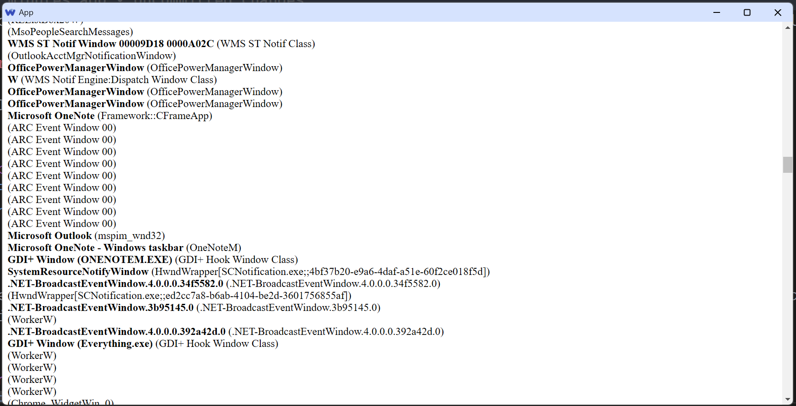

# Deno WebUI Template with full typing support

[Deno WebUI](https://github.com/webui-dev/deno-webui) makes creating client application easily. However the official example lacks typing support for the APIs.
This template brings typescript and type bindings to the web(UI) part.

This template enumerates all windows on Windows OS and shows them in the UI to demonstrate typed-communications between frontend and backend.

To run it, clone the repo and run: `run.bat` on Windows, or invoking tsc and deno manually on other platforms.

## What's improved?

You define API interfaces between the web client and the backend script in `api.ts`:

```typescript
    export type API = {
        checkResult: (a:number, b:number, res:number) => string,
        getWindows: () => {title:string, className:string}[]
    }
```

Then you implement the API in `api_impl.ts`. You also need to do minor work to bind the API to the web client and write thin wrapper in `api.ts` to add typings for web client:

```typescript
    export const api: Promisify<API> = {
        checkResult: (a, b, res) => backendAPI.checkResult(a, b, res).then(r => JSON.parse(r)),
        getWindows: () => backendAPI.getWindows().then(r => JSON.parse(r))
    }
```

Now you can use the typing API in the web client, e.g.:

```typescript
    import {api} from '../api.js'
    ...
    const windows = await api.getWindows()
    for (const w of windows) {
        const div = document.createElement('div');
        div.innerHTML = `<b>${w.title}</b> (${w.className})`;
        app.appendChild(div);
    }
    document.body.appendChild(app);
```
